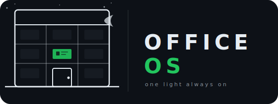

<p align="center">
  
</p>

<p align="center">
  
  
  
  
  
</p>

---

You are the on-call, the router, the person colleagues Slack when they don't know who else to ask. You know the codebase better than anyone because you've been paged about it at every hour. You handle the overnight jobs because nobody else has context. You write the status updates. You approve the deploys.

officeOs builds you a team to handle that.

An orchestrator who reads every agent's job description and routes without asking you. An analyst who watches your systems so you stop waking up to surprises. Specialists who know their domain, hand off what isn't theirs, and surface only the decisions that actually need a human.

They live on your infra. They talk through your Slack. The keys stay with you.

```
You:    What shipped overnight?

Chief:  Overnight summary:
        · Analyst ran nightly metrics — no anomalies
        · Codebase agent answered 3 questions from the team
        · Deploy pipeline ran at 02:14, one approval pending

You:    allow

Chief:  ✅ Deploy complete. Everything green.
```

```
Colleague (Slack):  How does the rate limiter work?

Chief:  Routing to codebase agent.
        Rate limiter: token-bucket. 10 req/60s per user, 100 req/60s global.
        Config: src/middleware/rate-limit.ts
```

```
Boss:   Migration needs your sign-off.
        File: /workspace/db/migrations/0042_users.sql
        Triggered by: deploy pipeline
        Request ID: a1b2c3
        Reply: allow a1b2c3 / deny a1b2c3

You:    allow a1b2c3

Boss:   ✅ Done. Back to sleep.
```

Your team, your infra. Agents run on your machine, talk through your Slack, and can only touch what you explicitly give them. The keys are yours.

## How it works

Every agent declares a job description — what it handles, what it provides, what's out of scope. The orchestrator reads all of them on every query and routes by intent, not keywords. "How does the auth module work?" reaches the codebase agent because its responsibility is explaining internal code, not because "auth" appears in a lookup table.

When no specialist fits, the orchestrator handles it directly or tells you one doesn't exist yet.

## Install

```bash
git clone https://github.com/reshadat/officeOs.git
cd officeOs && npm install && npm run build && npm install -g .

officeos install
officeos init myorg
officeos add-agent orchestrator --template orchestrator --org myorg
officeos add-agent analyst     --template analyst     --org myorg
```

Add Slack credentials to `orgs/myorg/agents/orchestrator/.env`, then:

```bash
officeos ecosystem
pm2 start ecosystem.config.js && pm2 save && pm2 startup
```

→ [Full setup guide](SETUP.md) — Slack app, hooks, agent config, Docker, security.

## When to skip

This is overhead if you want a single session. It's for agents you want running when you're not.

No Slack? Run headless (`slack_polling: false`) and use the file bus for inter-agent comms.

---

Adapted from [cortextOS](https://github.com/grandamenium/cortextos) by grandamenium. MIT license.
